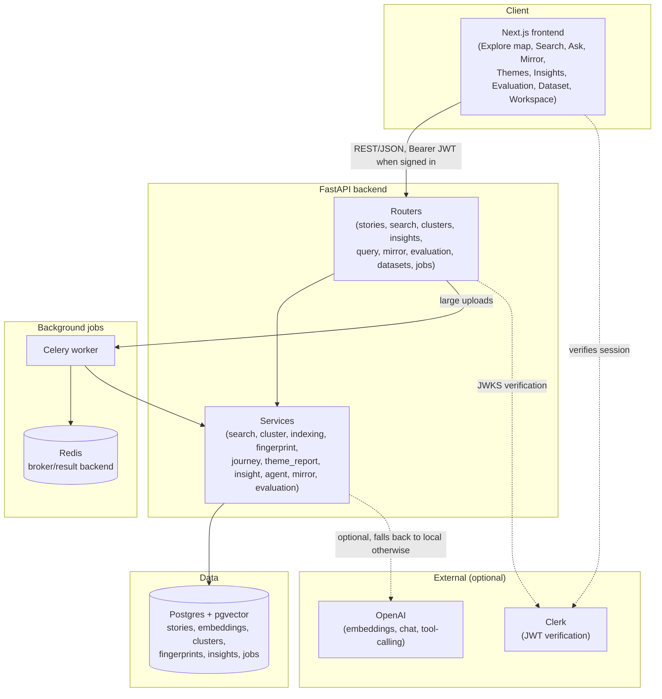

# Architecture

## Product framing

**Find yourself in someone else's experience.** Thread turns a collection of personal narratives into something
explorable rather than just searchable. There are four user-facing objects, and everything else in the system exists
to power them:

- **Story** — a person's narrative, the raw unit.
- **Theme** — what a group of stories share (internally a `Cluster`; never surfaced as "cluster" in the UI).
- **Journey** — how one story relates to others: its nearest neighbors, a deliberately contrasting story, and why.
- **Insight** — a statistically real pattern noticed across many stories (a correlation, or a standout story).

Narrative fingerprints, embeddings, and cluster runs are implementation details that power these four objects — they
are not features in their own right. The one place they surface directly is a "curious? see the raw signal" toggle
on the story page, for people who want to look under the hood.

Because none of the four objects are specific to personal narratives, the same architecture works for interview
transcripts, oral histories, therapy reflections, or research responses — this is a platform for exploring
qualitative data generally, demonstrated on one dataset (the "WHO WE ARE" story collection).

## System overview

## Components

### Frontend (`frontend/`, Next.js 16 + TypeScript + Tailwind + TanStack Query)

- `/` — the interactive story map (the homepage, not the search box): a PCA scatter plot where hovering previews a
  story, clicking opens it, double-clicking highlights its Journey neighbors, a text box highlights matches live, and
  zoom/pan controls split apart dense themes.
- `/search` — semantic search across sentence/passage/story granularity.
- `/ask` — conversational exploration; a tool-calling agent answers in plain language (see Conversational agent
  below).
- `/mirror` — "mirror my story": paste an ad hoc narrative, no account needed, and see the closest real stories.
- `/clusters` — Themes: theme cards with an AI-written or rule-based summary and member stories.
- `/insights` — statistically computed correlations and standout stories.
- `/evaluation` — the retrieval evaluation dashboard (current run, score distribution, historical/model comparison).
- `/dataset` — the raw story table.
- `/workspace` — sign in, create private datasets, upload CSVs, index/re-index them.
- `/stories/[id]` — a story's page: theme → Journey → contrasting story → reflection questions → fingerprint chart
  behind the "curious?" toggle.

### Backend (`backend/app/`, FastAPI)

- `routers/` — one module per resource; thin, auth/scoping-aware, no business logic (see `docs/api.md` for the full
  route reference).
- `services/` — the actual logic, reusable outside the HTTP layer (used directly by Celery tasks and scripts):
  - `search_service.py` — pgvector cosine-distance ranking over sentence/passage/story embeddings.
  - `cluster_service.py` — theme membership, summaries, and the PCA projection for the map.
  - `indexing_service.py` — chunking + embedding + clustering, shared by the sync route and the Celery task.
  - `fingerprint_service.py` — narrative fingerprint scoring (LLM with a deterministic keyword fallback) and the
    "why are these similar?" explanation.
  - `journey_service.py` — nearest/farthest neighbor lookups for the Journey feature.
  - `theme_report_service.py` — AI-synthesized theme summaries, grounded in sample text + fingerprint averages.
  - `insight_service.py` — correlations and per-story superlatives (most representative, most unique, most complex,
    theme-bridging, theme-migration), each thresholded by real effect size/sample size.
  - `agent_service.py` — the conversational tool-calling agent.
  - `mirror_service.py` — ad hoc embedding + matching for "mirror my story."
  - `evaluation_service.py` — Recall@K/MRR/Precision@K computation and persistence.
  - `dataset_service.py`, `embedding_columns.py` — dataset ownership/visibility scoping, and the provider-label ↔
    model-id ↔ vector-column mapping (see `docs/database_schema.md`).
- `models.py` — SQLAlchemy models (see `docs/database_schema.md`).
- `celery_app.py` / `tasks.py` — background indexing above the sync threshold (see `docs/scaling.md`).
- `llm.py` — raw `urllib` wrapper around OpenAI's chat completions endpoint (plain text and tool-calling), used by
  `fingerprint_service`, `theme_report_service`, `insight_service`, and `agent_service`.
- `embeddings.py` — local MiniLM (`sentence-transformers`, offline-first) and optional OpenAI embeddings, with a
  deterministic hashing fallback if the local model can't load.

### Conversational agent (`/ask`, `POST /query`)

A tool-calling loop over four tools, each a thin wrapper over an existing service — `search_stories`,
`filter_by_dimension`, `describe_theme`, `compare_stories`. The agent cannot retrieve or assert anything the rest of
the app couldn't already show directly; it has no separate retrieval path and no ability to invent a finding. Falls
back to a plain "not configured" message when no OpenAI key is set.

### Insight engine (`/insights`, `GET /datasets/{id}/insights`)

Every finding is computed from real data — Pearson correlation across narrative-fingerprint dimensions, or a
per-story superlative derived from embeddings/fingerprints — and thresholded by effect size and sample size before
being surfaced. An LLM may rephrase an already-computed finding for readability; it never asserts the statistic.
Findings are persisted (`insight_findings`) rather than recomputed per page load.

## Data flow: indexing a dataset

1. `POST /datasets/{id}/upload` — a CSV (`story_text` column required) is parsed, enriched (title/focus/word count
   via `app/data.py`), and inserted as `Story` rows.
2. `POST /datasets/{id}/index` (or `/reindex`, for a different `embedding_model`) — chunks each story into sentence,
   passage, and story-level `TextUnit`s, embeds them, and clusters the whole-story embeddings. Below 25 stories this
   runs synchronously in the request; at or above it, it's dispatched to Celery and polled via `GET /jobs/{id}`.
   Indexing is idempotent: re-running it reuses existing `TextUnit`s and only inserts `Embedding` rows for
   `(text_unit, model, version)` combinations that don't already exist, so re-indexing under a new model never
   deletes the old one.
3. Once ready, `Story`/`TextUnit`/`Embedding` rows back every read surface: search, the map, themes, journeys,
   fingerprints, and insights.

## Data flow: retrieval

1. `POST /search` embeds the query (same provider as the target embeddings) and ranks `TextUnit`s by pgvector cosine
   distance — no in-memory NumPy ranking, unlike the original Streamlit prototype this project began as.
2. Journey (`GET /stories/{id}/journey`) is the same idea applied to whole-story embeddings: nearest neighbors and a
   deliberately farthest "contrasting" story, both pure pgvector queries against embeddings already computed at index
   time — no new inference cost.
3. "Mirror my story" (`POST /mirror`) embeds a pasted, unpersisted piece of text on the fly and runs the same
   nearest-neighbor query against the public seed dataset — the only fully public, unauthenticated write-adjacent
   route, so it's rate-limited (see `docs/security.md`).

## Auth model

Clerk issues a JWT; the backend verifies it against Clerk's JWKS endpoint (`CLERK_JWKS_URL`) and lazily creates a
local `User` row keyed by `clerk_user_id` on first sight. Until `CLERK_JWKS_URL` is set, sign-in is inert (the "not
configured" UI is what M5 explicitly verified) but every public route keeps working — the public seed dataset is
`visibility='public'` and ownerless, so the whole app is usable read-only with no account at all. See
`docs/security.md` for the full scoping model.

## Reused from the original prototype

The pre-migration Streamlit prototype's retrieval/clustering/evaluation logic (cosine similarity, KMeans + TF-IDF
labeling, Recall@K/MRR) was deliberately kept rather than rewritten — see `backend/app/search.py`,
`backend/app/clustering.py`, `backend/app/evaluation.py`, and `backend/tests/*.py` (the original pure-logic unit
tests, still green). What changed across the migration was persistence (CSV/`.npy` → Postgres+pgvector), interface
(Streamlit → Next.js+FastAPI), concurrency (sync → Celery above a size threshold), and multi-tenancy (one shared
corpus → user-owned datasets plus one public one). `backend/streamlit_app.py` still exists and still runs, but is no
longer the primary way to use this project.

## Related docs

- `docs/api.md` — full route reference.
- `docs/database_schema.md` — full table/relationship reference.
- `docs/scaling.md` — the local→cloud path, ivfflat/hnsw tuning, and future experiments (UMAP, HDBSCAN).
- `docs/evaluation.md` — the evaluation system in depth.
- `docs/security.md` — auth, scoping, rate limiting, and known gaps.
