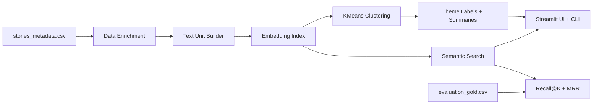

# Architecture

## Problem

The WHO WE ARE dataset is qualitative narrative data. Exact keyword search misses many useful matches because the important signal is thematic: identity, belonging, voice, access, care, and growth.

## System Overview

## Components

- `src/data.py`: loads stories and adds derived metadata.
- `src/text.py`: creates sentence, passage, and story-level retrieval units.
- `src/embeddings.py`: embeds text with local MiniLM or optional OpenAI embeddings.
- `src/search.py`: computes cosine similarity and ranks results.
- `src/clustering.py`: runs KMeans, labels clusters with TF-IDF terms, and summarizes clusters.
- `src/evaluation.py`: computes Recall@K and MRR from a small gold set.
- `src/pipeline.py`: composes data, embeddings, clustering, and retrieval indexes.
- `src/cli.py`: exposes search, cluster, and evaluate commands.
- `app.py`: UI layer only.

## Retrieval Flow

1. Load and enrich stories.
2. Split each story into the selected unit: sentence, passage, or full story.
3. Embed all units.
4. Embed the query.
5. Rank units by cosine similarity.
6. Show the top K matches with story context.

## Evaluation

`data/evaluation_gold.csv` contains hand-labeled query-to-story expectations. The evaluator reports:

- `Recall@K`: whether any expected story appears in the top K results.
- `MRR`: how high the first expected story appears in the ranking.

This is intentionally small, but it turns the demo into an auditable retrieval system.

## Scaling Path

For 10 stories, in-memory NumPy arrays are enough. For 10M documents:

- Store embeddings in a vector database or ANN index such as FAISS, ScaNN, or pgvector.
- Batch embeddings through a queue.
- Version embedding indexes by model name and preprocessing version.
- Store document metadata separately from vector payloads.
- Add offline evaluation jobs and relevance dashboards.
- Add access control if stories contain sensitive personal data.

## Tradeoffs

- Local MiniLM is fast, free, and reproducible, but less powerful than larger embedding models.
- If the local MiniLM model cannot be loaded offline, the CLI falls back to deterministic hashing vectors so commands remain runnable.
- API embeddings can improve retrieval quality, but add cost, latency, secrets management, and network dependency.
- KMeans is simple and explainable, but cluster count must be chosen manually.
- TF-IDF labels are transparent, but less fluent than LLM-generated labels.
